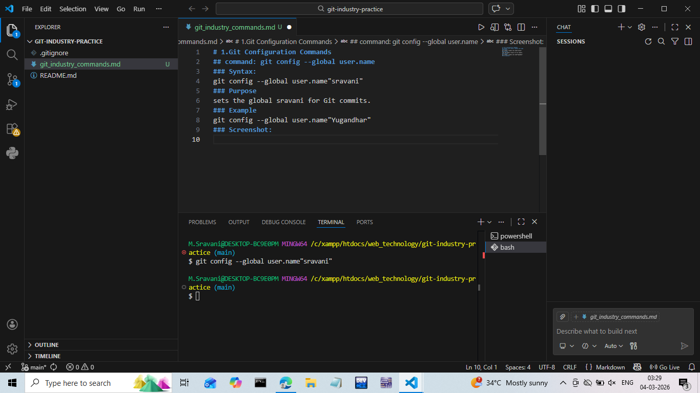
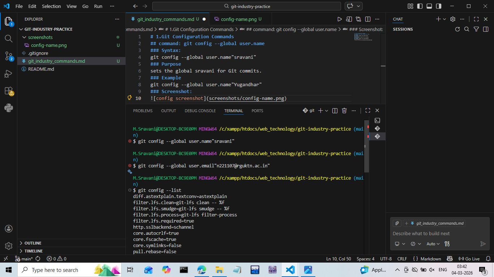

# 1.Git Configuration Commands
## command: git config --global user.name
### name
### Syntax:
git config --global user.name"sravani"
### Purpose
sets the global sravani for Git commits.
### Example
git config --global user.name"Yugandhar"
### Screenshot:

### email
### Syntax:
git config --global user.email"n221107@rguktn.ac.in"
### Purpose
Sets the global email for Git commits.
### Example
git config --global user.email"n221107@rguktn.ac.in"
### Screenshot:

### list
### Syntax:
git config --list
### Purpose
Displays all Git configuration settings.
### Example
git config --list
### Screenshot:

.png)
.png)

### unset
### Syntax:
git config --unset user.name
### Purpose
Removes a configuration setting.
### Example
git config --unset user.name
### Screenshot:
.png)

### 2.Repository Setup commands
### init
### Syntax:
git init
### Purpose
Initializes a new Git repository.
### Example
git init
### Screenshot:
.png)

### clone
### Syntax:
git clone https://github.com/sravani-221107/git-practice
### Purpose
Copies an existing repository.
### Example
git clone https://github.com/sravani-221107/git-practice
### Screenshot:
.png)

### branch
### Syntax:
git clone --branch main https://github.com/sravani-221107/git-practice
### Purpose
Clones a specific branch.
### Example
git clone --branch main https://github.com/sravani-221107/git-practice
### Screenshot:
.png)

### depth
### Syntax:
git clone --depth 1 https://github.com/sravani-221107/git-practice
### Purpose
Creates a shallow clone.
### Example
git clone --depth 1 https://github.com/sravani-221107/git-practice
### Screenshot:
.png)

### 3.Status & Inspection
### status
### Syntax:
git status
### Purpose
Shows repository status.
### Example
git status
### Screenshot:
.png)

### log
### Syntax:
git log
### Purpose
Displays commit history.
### Example
git log
### Screenshot:
.png)

### log --oneline
### Syntax:
git log --oneline
### Purpose
Short commit history.
### Example
git log --oneline
### Screenshot:
.png)

### log --graph
### Syntax:
git log --graph
### Purpose
Shows commit graph.
### Example
git log --graph
### Screenshot:
.png)

### show
### Syntax:
git show
### Purpose
git show HEAD
### Example
git show
### Screenshot:
.png)
.png)
.png)

### diff
### Syntax:
git diff
### Purpose
shows unstaged changes
### Example
git diff
### Screenshot:
.png)

### diff --staged
### Syntax:
git diff --staged
### Purpose
Shows staged changes.
### Example
git diff --staged
### Screenshot:
.png)

### blame
### Syntax:
git blame
### Purpose
Shows line-wise author info.
### Example
git blame
### Screenshot:
.png)
.png)

### reflog
### Syntax:
git reflog
### Purpose
Shows HEAD history.
### Example
git reflog
### Screenshot:
.png)

### shortlog
### Syntax:
git shortlog
### Purpose
Commit summary by author.
### Example
git shortlog
### Screenshot:
.png)

### File Tracking Commands
### git add
Syntax:
git add file-name
### Purpose:
Adds file to staging area.
### Example:
git add test.txt
### Screenshot:
.png)
.png)

### git add .
### Syntax:
git add .
### Purpose:
Adds all files.
### Example:
git add .
Screenshot:
.png)

### git add -p
### Syntax:
git add -p
### Purpose:
Adds changes interactively.
### Example:
git add -p
### Screenshot:
.png)

### git restore
### Syntax:
git restore file-name
### Purpose:
Restores working directory file.
### Example:
git restore test.txt
### Screenshot:
.png)

### git restore --staged
### Syntax:
git restore --staged file-name
### Purpose:
Unstages a file.
### Example:
git restore --staged test.txt
### Screenshot:
.png)

### git rm
### Syntax:
git rm file-name
### Purpose:
Removes tracked file.
### Example:
git rm test.txt
### Screenshot:
.png)

### git mv
### Syntax:
git mv old-name new-name
### Purpose:
Renames file.
### Example:
git mv old.txt new.txt
### Screenshot:
.png)
